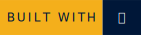
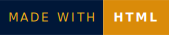
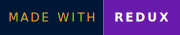
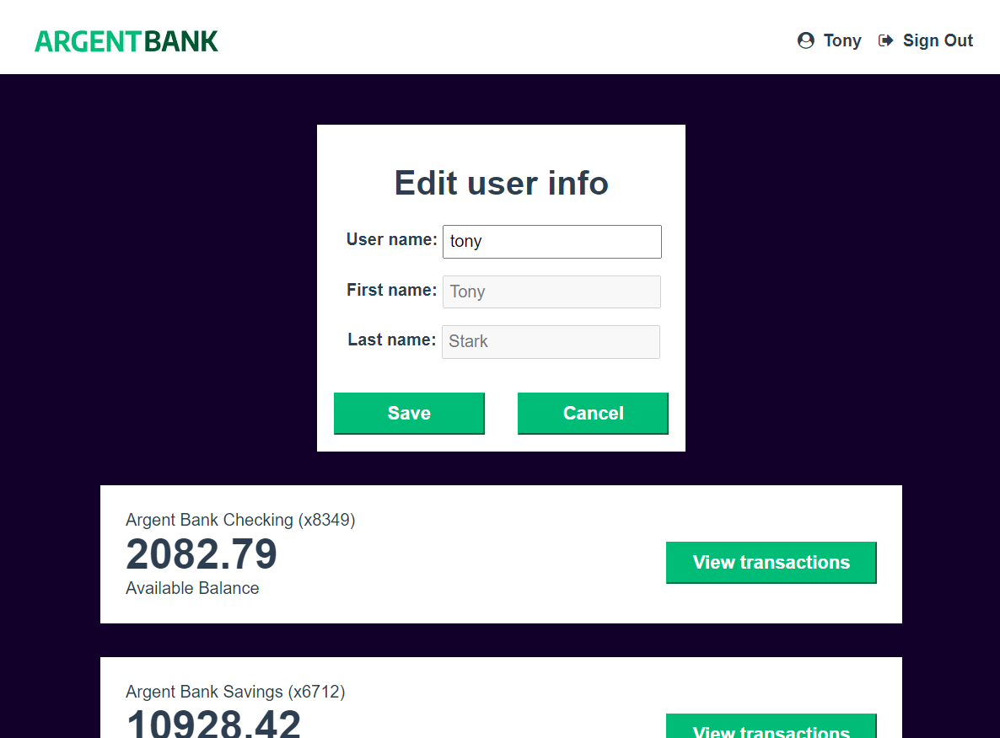

        


# Argent Bank
 

This repository contains the code needed to run both the frontend and backend for Argent Bank.
The frontend is coded in React, and the backend with Node.js, Express, and MongoDB

## Description
Argent Bank is a web application for a banking agency.

## Screenshots



## Installation

To install and run this project locally on your machine, follow these simple steps:

1. Make sure you have Node.js installed on your machine. If not, you can download and install it from [the official Node.js website](https://nodejs.org/).

2. Clone this GitHub repository to your local machine using the following command:

    ```
    git clone https://github.com/Merzakb/P11_benaissi-merzak_ArgentBank-website.git
    ```

3. Install the necessary dependencies :

### Frontend application
Run the following commands:

```bash
# Navigate to the frontend directory
cd Frontend_react
```

```bash
# Install dependencies
npm install
```

```bash
# Start local dev server
npm start
``` 
Open your browser and go to the following URL http://localhost:3000
    
### Backend server
Run the following commands:

```bash
# Navigate to the server directory
cd server
``` 
```bash
# Install dependencies
npm install
``` 
```bash
# Start local dev server
npm run dev:server
``` 
Your server should now be running at http://locahost:3001 and you will now have two users in your MongoDB database!


## Populated Database Data

Once you run the `populate-db` script, you should have two users in your database:

### Tony Stark

- First Name: `Tony`
- Last Name: `Stark`
- Email: `tony@stark.com`
- Password: `password123`

### Steve Rogers

- First Name: `Steve`,
- Last Name: `Rogers`,
- Email: `steve@rogers.com`,
- Password: `password456`

## API Documentation

To learn more about how the API works, once you have started your local environment, you can visit: http://localhost:3001/api-docs

## Design Assets

Static HTML and CSS has been created for most of the site and is located in: `/designs`.

For some of the dynamic features, like toggling user editing, there is a mock-up for it in `/designs/wireframes/edit-user-name.png`.

And for the API model that you will be proposing for transactitons, the wireframe can be found in `/designs/wireframes/transactions.png`.


## Technologies :
       


## Authors
- [@Merzak](https://github.com/Merzakb)


## 🔗 Links
[](https://merzak-portfolio.vercel.app/)
[](https://www.linkedin.com/in/merzak-b-0300b9289/)
[](https://twitter.com/__merzak)